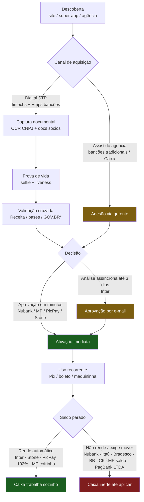

# 📊 Comparativo — Conta PJ (11 players + BTG farol)

> ✅ **Cobertura completa (11/11).** Piloto (Itaú, Bradesco, BB, Nubank, Inter, Mercado Pago) + Expansão (Santander, Caixa, C6, PicPay, PagBank/Stone). BTG entra como **farol** (banco de investimento digital), fora dos 11 padrão. Fecha a categoria Conta-PJ do [[_Ledger-Produtos]] — antes 🟨 parcial (5/11).

**Recorte (1 frase):** matriz mestre da conta PJ dos 11 players no momento em que **tarifa zero virou commodity** e a diferenciação migrou para três eixos — **rendimento do saldo**, **atrito de onboarding** e **IA/dado de fluxo** — com um quarto eixo (governança de agentes) surgindo na fronteira.

## 🗺️ Fluxograma — jornada de abertura de Conta PJ

*\*GOV.BR: integração pública de autenticação declarada por Inter (acordo MGI, 35 mi, jun/2025) e C6.*

**Leitura do fluxo:** os dois pontos onde a jornada bifurca — **canal de aquisição** (STP digital vs agência) e **destino do saldo** (rende automático vs inerte) — são onde a diferenciação competitiva se decide. Verde = melhor prática; amarelo = atrito; vermelho = perda de valor.

## 📊 Matriz mestre — 11 players

| Player | Classe | Mensalidade | Rendimento do saldo PJ | Onboarding | Maquininha | IA embarcada | EMA-J | Febraban |
|--------|--------|-------------|------------------------|------------|------------|--------------|:-----:|:--------:|
| **Itaú** (Emps) | bancão | R$ 0 (Emps) / tarifado (tradic.) | Não automático | Baixo (Emps) | Rede (própria) | Forte (3D liveness/assistentes) | L4 | ✔ |
| **Bradesco** (Cestas) | bancão | R$ 121,90–479,90 | Não automático | Alto (agência) | Cielo | BIA | L4 | ✔ |
| **Banco do Brasil** | bancão estatal | R$ 0 (Digital MEI/EI) / tarifado | Não automático | Baixo (digital) | — | Conversacional + Pix imagem/áudio (WhatsApp) | L3 | ✔ |
| **Nubank** | fintech | R$ 0 | Não (só Caixinha 100% CDI) | Muito baixo (via PF) | Tap to Pay | Forte na PF | L4 | n/consta |
| **Inter** (Empresas) | fintech | R$ 0 | **100% CDI automático** | Baixo (decisão ≤3 dias) | Inter Pag + Tap | Crescente + GOV.BR | L4 | n/consta |
| **Mercado Pago** | fintech | R$ 0 | Não (cofrinho 115% CDI) | Muito baixo | Point + Tap | IA/antifraude como produto | L4 | n/consta |
| **Santander** (Emps) | bancão | Zerável por Getnet/volume | [sem fonte] | Baixo (online) | Getnet | IA de grupo (€1bi 26-28) / G42 | L3 | ✔ |
| **Caixa** | bancão estatal | R$ 0 (MEI Digital) | [sem fonte] | Médio/alto | — | Ausente no fluxo | **L2** | ✔ |
| **C6** (Empresas) | fintech | R$ 0 | Não (CDB 102% CDI) | Baixo | Parceria | C6 Assistant + Pix 1:N | L3 | n/consta |
| **PicPay** | fintech | R$ 0 | **102% CDI automático (≥R$1)** | Muito baixo | Própria | Multiagente GPT-4.1 (A2A/MCP) | L4 | n/consta |
| **PagBank/Stone** | fintech-adquirente | R$ 0 (PagBank R$75/ano inativ.) | **Stone 100% CDI** / PagBank 3%–100% CDI (≤R$100k) | Muito baixo | Própria (âncora) | Back/atendimento + cobrança agêntica (Stone, trilho 3º) | L4 | n/consta |
| *BTG (farol)* | *banco-invest.* | *R$ 0 (Básico)* | *Automático (% n/d)* | *Médio* | *Parceria* | *Advisory/research* | *L3* | *✔* |

*Fontes: tarifários e FAQs públicos + comparativos 2026 — tarifa e rendimento com fonte+data nas fichas individuais em `02-Produtos/Conta-PJ/`.*

## ⭐ Diferenciais reais (o que só um faz)
- **Inter** — único com rendimento automático 100% CDI no saldo *e* GOV.BR declarado.
- **PicPay** — maior rendimento automático de saldo PJ do grupo (**102% CDI a partir de R$ 1**) + arquitetura de agentes A2A/MCP mais explícita.
- **Stone** — saldo 100% CDI automático **colado à maquininha** (zera antecipação) + cobrança agêntica.
- **Itaú** — única maquininha própria de porte (Rede) + régua 3D liveness anti-deepfake.
- **Santander** — única com isenção amarrada à adquirente do grupo (Getnet) — e o stack G42 (soberania).
- **Nubank** — menor atrito de onboarding (cross-sell da base PF).
- **BB / Caixa** — soberania de dado estatal (social + agro) nativa — subutilizada por IA.

## 🕳️ Lacuna vendável (→ oferta consultiva)
1. **Saldo inerte na maioria** — Itaú, Bradesco, BB, Nubank (saldo), C6, Mercado Pago (saldo) e PagBank (LTDA/SA 3%) deixam o caixa parado enquanto Inter, PicPay (102%) e Stone (100%) rendem automático. Diferenciação de produto na mesa (Oferta #2 — FinOps/unit economics).
2. **Dado de fluxo de caixa PJ subutilizado por crédito AI-native auditável** — os 11 têm o dado; ninguém expõe originação governada com trilha art. 20 LGPD sobre ele. **Maior lacuna de categoria** (Oferta #5 / [[INI-Onboarding-Agentico-Governado]]).
3. **Mandato agêntico é de terceiro nos adquirentes** — Stone cobra por agente mas **aluga o mandato do Iniciador** (mesmo padrão de Pagamentos F2-3). Trilho de mandato próprio e governado é a saída da dependência (gancho Cohort).
4. **Assimetria de piso regulatório** — incumbentes/estatais (Itaú, Bradesco, BB, Santander, Caixa) na autorregulação Febraban; fintechs (Nubank, Inter, MP, C6, PicPay, PagBank/Stone) fora. Governança vira diferencial vendável para quem está fora.
5. **Caixa (L2, 130 mi+) é o vale mais profundo** — maior base social, dado mais sensível, IA ausente no fluxo, procurement estatal como fricção.

## 🗣️ O que eu diria num board
⏳ **para o Bruno.** (Insumos consolidados: em 2026 a conta PJ está commoditizada em tarifa; a briga real corre em quatro eixos — **rendimento do saldo** (Inter/PicPay/Stone à frente), **atrito de onboarding** (Nubank/MP/PicPay à frente), **IA/dado de fluxo** (todos atrasados no agêntico) e **governança de agentes** (fronteira aberta, PicPay o mais adiantado por A2A/MCP). O incumbente defende com verticalização (Rede/Getnet/Cielo) e régua Febraban obrigatória; a fintech ataca com rendimento e conveniência. A tese de oferta mora onde os eixos cruzam: instrumentar o **caixa PJ** com crédito auditável e mandato agêntico governado — e nos adquirentes, com trilho de mandato próprio em vez do de terceiro.)

---
**Fontes:** fichas individuais em `02-Produtos/Conta-PJ/` (11 players + BTG) · tarifários públicos Bacen · FAQs oficiais (PagBank, PicPay, Mercado Pago) · comparativos 2026 (iDinheiro, Runzos, InfinitePay, Contabilidade.com, Jota, Capitalistas)
**Liga com:** [[00-Blueprint-Mapeamento-Produtos-Banking-BR]] · [[_Ledger-Produtos]] · [[De-Para — Onboarding & KYC]] · [[Comparativo — Adquirência]] · [[Banco do Brasil — Conta PJ Digital]] · [[Mercado Pago — Conta PJ]] · [[Santander — Conta PJ]] · [[Caixa — Conta PJ (MEI e Empresarial)]] · [[C6 — Conta PJ (C6 Empresas)]] · [[PicPay — Conta PJ]] · [[PagBank-Stone — Conta PJ]]
